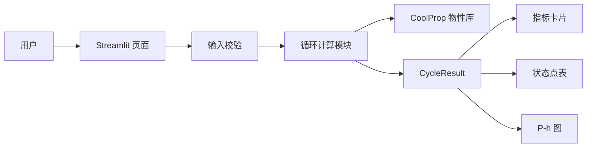

# 制冷系统仿真软件技术设计文档

## 1. 设计目标

本设计将《产品设计文档》转换为可实施的 MVP 技术方案，目标是用最少的模块完成以下闭环：

```text
输入循环参数 → 校验参数 → 调用 CoolProp → 计算四个状态点
    → 计算性能指标 → 展示指标、状态表和 P-h 图
```

首版只支持本地运行的单级稳态蒸汽压缩制冷循环，不引入数据库、后端服务、登录和持久化。

## 2. 已确定的技术决策

| 项目 | 决策 |
| --- | --- |
| 运行形态 | 本地 Web 应用 |
| Web 框架 | Python + Streamlit |
| 物性库 | CoolProp |
| 图表 | matplotlib |
| 测试 | pytest |
| 首版制冷剂 | R134a、R410A、R32 |
| 单位体系 | 内部计算使用 SI，界面展示工程常用 SI 单位 |
| 数据存储 | 无；每次仿真使用当前页面输入 |
| 默认语言 | 中文 |

当前环境为 Python 3.14.7，CoolProp 已可导入；Streamlit、matplotlib 和 pytest 需要作为项目依赖安装。

## 3. 总体架构

采用单进程、单页面、纯计算模块与 UI 分离的结构：



### 3.1 模块职责

- `app.py`：页面布局、控件读取、按钮触发、结果展示和用户可读错误提示。
- `cooling_cycle.py`：输入模型、状态点模型、参数校验、物性调用、循环能量计算。
- `tests/test_cooling_cycle.py`：计算模块的单元测试，不依赖 Streamlit 页面。
- `plotting` 逻辑：首版直接放在 `app.py` 中；只有当图表逻辑明显增长时再拆分文件。

### 3.2 推荐目录结构

```text
C:\codex\Cooling system\
├── AGENTS.md
├── 产品设计文档.md
├── 技术设计文档.md
├── README.md
├── requirements.txt
├── app.py
├── cooling_cycle.py
└── tests\
    └── test_cooling_cycle.py
```

首版不创建复杂的包层级，避免为一次性模块引入不必要的抽象。

## 4. 领域数据结构

### 4.1 `CycleInputs`

表示用户提交的一组仿真输入，字段和单位如下：

```text
refrigerant: str                         # R134a / R410A / R32
evaporating_temperature_c: float         # °C
condensing_temperature_c: float          # °C
superheat_k: float                       # K
subcooling_k: float                      # K
mass_flow_kg_s: float                    # kg/s
compressor_isentropic_efficiency: float  # 0~1，界面百分比转为小数
```

界面层负责把效率百分比转换为 0~1 的小数；计算模块不接收百分比数值，避免单位语义混淆。

### 4.2 `StatePoint`

```text
number: int                    # 1~4
name: str                      # 中文位置名称
pressure_pa: float             # Pa
temperature_k: float           # K
enthalpy_j_kg: float           # J/kg
entropy_j_kg_k: float          # J/(kg·K)
quality: float | None          # 0~1；非两相或不适用时为 None
```

内部统一使用绝对温度、绝对压力和 SI 能量单位；只在页面格式化时转换为 °C、kPa 和 kJ/kg。

### 4.3 `CycleResult`

```text
inputs: CycleInputs
states: tuple[StatePoint, StatePoint, StatePoint, StatePoint]
specific_refrigeration_effect_j_kg: float
specific_compressor_work_j_kg: float
specific_condenser_rejection_j_kg: float
cooling_capacity_w: float
compressor_power_w: float
cop: float
```

对外暴露一个主函数：

```text
simulate_cycle(inputs: CycleInputs) -> CycleResult
```

### 4.4 错误类型

- `InputValidationError(ValueError)`：输入关系或数值范围不满足要求。
- `PropertyCalculationError(ValueError)`：CoolProp 无法为参数组合计算有效物性状态。

UI 只捕获这两类预期错误并转为中文提示；不吞掉未知异常，未知异常应保留堆栈以便开发诊断。

## 5. 循环计算流程

### 5.1 输入转换与压力边界

1. 将蒸发温度和冷凝温度从 °C 转为 K。
2. 通过 CoolProp 获取饱和压力：

```text
P_low  = PropsSI("P", "T", T_evap_K, "Q", 0, refrigerant)
P_high = PropsSI("P", "T", T_cond_K, "Q", 0, refrigerant)
```

3. 确认 `P_high > P_low`，否则停止计算。

### 5.2 四个状态点

#### 状态点 1：压缩机入口

```text
T1 = T_evap_K + superheat_K
h1 = PropsSI("H", "P", P_low, "T", T1, refrigerant)
s1 = PropsSI("S", "P", P_low, "T", T1, refrigerant)
```

#### 状态点 2：压缩机出口

先求等熵压缩出口焓，再根据压缩机等熵效率修正：

```text
h2s = PropsSI("H", "P", P_high, "S", s1, refrigerant)
h2  = h1 + (h2s - h1) / efficiency
T2  = PropsSI("T", "P", P_high, "H", h2, refrigerant)
s2  = PropsSI("S", "P", P_high, "H", h2, refrigerant)
```

#### 状态点 3：冷凝器出口

```text
T3 = T_cond_K - subcooling_K
h3 = PropsSI("H", "P", P_high, "T", T3, refrigerant)
s3 = PropsSI("S", "P", P_high, "T", T3, refrigerant)
```

#### 状态点 4：节流阀出口

节流过程按等焓处理：

```text
h4 = h3
T4 = PropsSI("T", "P", P_low, "H", h4, refrigerant)
s4 = PropsSI("S", "P", P_low, "H", h4, refrigerant)
```

通过 `PropsSI("Q", ...)` 尝试获取干度；如果返回值不在 0~1 或物性库表示该状态不适用，则保存为 `None`，页面显示“—”。

### 5.3 性能指标

```text
q_evap = h1 - h4
w_comp = h2 - h1
q_cond = h2 - h3
Q_dot  = mass_flow * q_evap
W_dot  = mass_flow * w_comp
COP    = q_evap / w_comp
```

内部单位为 J/kg、W，页面展示时转换为 kJ/kg、kW。

结果生成前检查 `q_evap > 0`、`w_comp > 0` 和 `COP > 0`；不满足时抛出 `PropertyCalculationError`，禁止展示不可信结果。

## 6. 输入校验规则

计算模块在调用 CoolProp 前执行基础校验：

| 条件 | 错误提示方向 |
| --- | --- |
| 制冷剂不在白名单 | 请选择 R134a、R410A 或 R32 |
| 冷凝温度 ≤ 蒸发温度 | 提高冷凝温度或降低蒸发温度 |
| 过热度 < 0 | 过热度不能为负数 |
| 过冷度 < 0 | 过冷度不能为负数 |
| 质量流量 ≤ 0 | 输入大于 0 的质量流量 |
| 效率 ≤ 0 或 > 1 | 输入 0~100% 范围内的效率 |
| 物性状态不可计算 | 调整温度、过热度或过冷度组合 |

不为输入控件设置过度严格的工程范围，避免把有效但非常规的研究工况误判为非法；由 CoolProp 负责最终物性有效性判断。

## 7. Streamlit 页面设计

### 7.1 页面状态

- 页面默认显示输入控件和初始提示，不伪造结果。
- 只有点击“运行仿真”后才计算。
- 计算成功时，使用当前输入更新结果。
- 计算失败时清除旧结果并显示错误，避免旧结果冒充当前输入结果。
- 不将结果写入文件或数据库。

### 7.2 页面布局

1. 页面标题和一句产品定位说明。
2. 侧边栏：制冷剂、温度、过热/过冷度、质量流量、压缩机效率和运行按钮。
3. 主区域顶部：制冷量、压缩机功率、COP 三个核心指标。
4. 主区域中部：比制冷量、比压缩功和当前输入摘要。
5. 主区域下部：状态点表和 P-h 图。
6. 页面底部：计算口径、模型限制和单位说明。

### 7.3 P-h 图绘制

- 横轴使用各状态点的 `enthalpy_j_kg / 1000`，标签为 `比焓 (kJ/kg)`。
- 纵轴使用各状态点的 `pressure_pa / 1000`，标签为 `压力 (kPa)`。
- 顺序固定为 `[1, 2, 3, 4, 1]`，首尾闭合。
- 纵轴使用对数刻度，状态点使用编号标注。
- 图表只绘制实际计算状态点和连接线，不绘制未经计算的饱和穹顶。

## 8. 依赖与运行方式

`requirements.txt` 至少包含：

```text
CoolProp
streamlit
matplotlib
pytest
```

推荐运行流程：

```text
python -m venv .venv
.venv\Scripts\activate
python -m pip install -r requirements.txt
pytest
streamlit run app.py
```

不引入数据库、Docker、前后端分离框架或外部服务。

## 9. 测试设计

### 9.1 计算模块单元测试

- 三种制冷剂均能完成一组常规工况计算。
- 输出包含四个按 1、2、3、4 排列的状态点。
- `P_high > P_low`。
- `h4 == h3`，验证节流等焓。
- `h2 > h1`，验证压缩机输入功为正。
- 制冷量、压缩机功率和 COP 为正值。
- 增大质量流量只改变总制冷量和总功率，不改变比指标和 COP。
- 重复使用同一输入得到一致结果。

### 9.2 输入校验测试

- 不支持的制冷剂。
- 冷凝温度不高于蒸发温度。
- 负过热度或过冷度。
- 零或负质量流量。
- 超出范围的压缩机效率。

### 9.3 交付检查

- `pytest` 全部通过。
- `python -m compileall app.py cooling_cycle.py tests` 通过。
- 使用常规默认参数启动 Streamlit，确认页面可加载。
- 手工执行一次成功仿真和一次错误输入仿真，确认旧结果不会残留。

## 10. 实施顺序

1. 建立依赖配置和核心数据结构，先完成输入校验测试。
2. 实现 CoolProp 四状态点计算和性能指标，完成计算模块测试后提交。
3. 实现 Streamlit 参数区、指标区和状态点表，完成页面启动检查后提交。
4. 实现 P-h 图、错误处理和口径说明，完成端到端验证后提交。
5. 更新 `README.md`，写入安装、测试和启动命令，再提交最终文档版本。

每个独立功能完成测试后使用中文 commit，提交前检查 `git status` 和 `git diff`。

## 11. 明确不做的技术扩展

首版不预留复杂插件机制、不实现通用流程图编辑器、不建立设备组件继承体系，也不提前设计数据库 schema。未来确实出现多循环或多设备需求时，再根据实际领域模型进行拆分。
